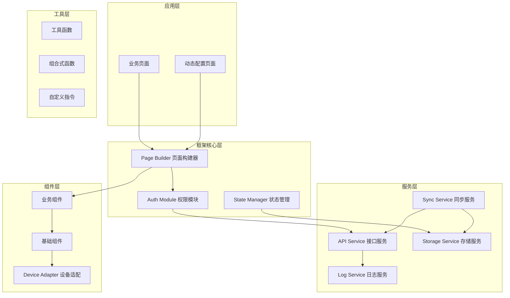

# 设计文档

## 概述

本设计文档描述了基于UniApp框架的MES/WMS移动端框架的技术架构和实现方案。该框架采用Vue3 + TypeScript技术栈，支持编译到微信小程序、H5、Android和iOS多端，专注于工业场景的移动端应用开发。

## 架构

### 整体架构图



### 目录结构

```
src/
├── api/                    # 接口定义
│   ├── modules/           # 按模块划分的接口
│   └── index.ts           # 接口统一导出
├── components/            # 组件库
│   ├── base/              # 基础组件
│   ├── business/          # 业务组件
│   └── index.ts           # 组件统一导出
├── composables/           # 组合式函数
│   ├── useAuth.ts         # 权限相关
│   ├── useDevice.ts       # 设备适配
│   ├── useScanner.ts      # 扫码功能
│   └── index.ts
├── config/                # 配置文件
│   ├── app.config.ts      # 应用配置
│   └── theme.config.ts    # 主题配置
├── directives/            # 自定义指令
│   └── permission.ts      # 权限指令
├── pages/                 # 页面
│   ├── login/             # 登录页
│   ├── home/              # 首页
│   └── dynamic/           # 动态页面容器
├── services/              # 服务层
│   ├── http/              # HTTP服务
│   ├── storage/           # 存储服务
│   ├── auth/              # 认证服务
│   ├── sync/              # 同步服务
│   └── log/               # 日志服务
├── store/                 # 状态管理
│   ├── modules/           # 状态模块
│   └── index.ts
├── types/                 # 类型定义
├── utils/                 # 工具函数
├── page-builder/          # 页面构建器
│   ├── parser/            # 配置解析器
│   ├── renderer/          # 组件渲染器
│   └── index.ts
├── App.vue
├── main.ts
├── manifest.json
├── pages.json
└── uni.scss
```

## 组件与接口

### 1. HTTP服务 (API_Service)

```typescript
// services/http/types.ts
interface RequestConfig {
  url: string;
  method: 'GET' | 'POST' | 'PUT' | 'DELETE';
  data?: Record<string, any>;
  headers?: Record<string, string>;
  timeout?: number;
  retry?: number;
  retryDelay?: number;
  cancelToken?: string;
}

interface ResponseData<T = any> {
  code: number;
  message: string;
  data: T;
  timestamp: number;
}

interface HttpService {
  request<T>(config: RequestConfig): Promise<ResponseData<T>>;
  get<T>(url: string, params?: Record<string, any>): Promise<ResponseData<T>>;
  post<T>(url: string, data?: Record<string, any>): Promise<ResponseData<T>>;
  put<T>(url: string, data?: Record<string, any>): Promise<ResponseData<T>>;
  delete<T>(url: string, params?: Record<string, any>): Promise<ResponseData<T>>;
  cancel(cancelToken: string): void;
  cancelAll(): void;
}
```

### 2. 权限模块 (Auth_Module)

```typescript
// services/auth/types.ts
interface UserInfo {
  id: string;
  username: string;
  realName: string;
  roles: string[];
  permissions: string[];
  token: string;
  refreshToken: string;
  tokenExpireTime: number;
}

interface AuthService {
  login(username: string, password: string): Promise<UserInfo>;
  logout(): Promise<void>;
  refreshToken(): Promise<string>;
  getUserInfo(): UserInfo | null;
  hasPermission(permission: string): boolean;
  hasRole(role: string): boolean;
  hasPageAccess(pageCode: string): boolean;
}

// directives/permission.ts
interface PermissionDirective {
  mounted(el: HTMLElement, binding: { value: string | string[] }): void;
  updated(el: HTMLElement, binding: { value: string | string[] }): void;
}
```

### 3. 设备适配器 (Device_Adapter)

```typescript
// composables/useDevice.ts
type DeviceType = 'phone' | 'tablet' | 'pda';

interface DeviceInfo {
  type: DeviceType;
  platform: 'android' | 'ios' | 'h5' | 'mp-weixin';
  screenWidth: number;
  screenHeight: number;
  pixelRatio: number;
  statusBarHeight: number;
  safeAreaInsets: {
    top: number;
    bottom: number;
    left: number;
    right: number;
  };
}

interface LayoutConfig {
  columns: number;
  gutter: number;
  fontSize: {
    base: number;
    small: number;
    large: number;
  };
  touchArea: {
    minWidth: number;
    minHeight: number;
  };
}

interface UseDeviceReturn {
  deviceInfo: Ref<DeviceInfo>;
  layoutConfig: Ref<LayoutConfig>;
  isPhone: ComputedRef<boolean>;
  isTablet: ComputedRef<boolean>;
  isPDA: ComputedRef<boolean>;
  onResize(callback: (info: DeviceInfo) => void): void;
}
```

### 4. 页面构建器 (Page_Builder)

```typescript
// page-builder/types.ts
interface PageConfig {
  pageCode: string;
  title: string;
  permission?: string;
  layout: LayoutConfig;
  components: ComponentConfig[];
  dataSource?: DataSourceConfig[];
  events?: EventConfig[];
}

interface ComponentConfig {
  id: string;
  type: string;
  props: Record<string, any>;
  children?: ComponentConfig[];
  dataBinding?: DataBindingConfig;
  permission?: string;
  visible?: boolean | string;
  events?: Record<string, EventConfig>;
}

interface DataSourceConfig {
  id: string;
  type: 'api' | 'static' | 'computed';
  config: Record<string, any>;
  autoLoad?: boolean;
}

interface DataBindingConfig {
  source: string;
  field: string;
  transform?: string;
}

interface EventConfig {
  type: string;
  action: 'api' | 'navigate' | 'script' | 'emit';
  config: Record<string, any>;
}

interface PageBuilder {
  parse(config: PageConfig): ParsedPage;
  render(parsedPage: ParsedPage): VNode;
  registerComponent(name: string, component: Component): void;
  registerAction(name: string, handler: Function): void;
}
```

### 5. 存储服务 (Storage_Service)

```typescript
// services/storage/types.ts
interface StorageService {
  get<T>(key: string): T | null;
  set<T>(key: string, value: T, expire?: number): void;
  remove(key: string): void;
  clear(): void;
  getSync<T>(key: string): T | null;
  setSync<T>(key: string, value: T, expire?: number): void;
}

interface SyncQueueItem {
  id: string;
  type: string;
  data: Record<string, any>;
  timestamp: number;
  retryCount: number;
}

interface SyncService {
  addToQueue(item: Omit<SyncQueueItem, 'id' | 'timestamp' | 'retryCount'>): void;
  processQueue(): Promise<void>;
  getQueueStatus(): { pending: number; failed: number };
  clearQueue(): void;
}
```

### 6. 日志服务 (Log_Service)

```typescript
// services/log/types.ts
type LogLevel = 'debug' | 'info' | 'warn' | 'error';

interface LogEntry {
  level: LogLevel;
  message: string;
  data?: Record<string, any>;
  timestamp: number;
  deviceInfo?: DeviceInfo;
  userInfo?: { id: string; username: string };
  stack?: string;
}

interface LogService {
  debug(message: string, data?: Record<string, any>): void;
  info(message: string, data?: Record<string, any>): void;
  warn(message: string, data?: Record<string, any>): void;
  error(message: string, error?: Error, data?: Record<string, any>): void;
  flush(): Promise<void>;
  getRecentLogs(count?: number): LogEntry[];
}
```

## 数据模型

### 用户与权限

```typescript
// types/auth.ts
interface User {
  id: string;
  username: string;
  realName: string;
  avatar?: string;
  department?: string;
  roles: Role[];
}

interface Role {
  id: string;
  code: string;
  name: string;
  permissions: Permission[];
}

interface Permission {
  id: string;
  code: string;
  name: string;
  type: 'menu' | 'page' | 'button' | 'data';
  resourceCode?: string;
}

interface Menu {
  id: string;
  code: string;
  name: string;
  icon?: string;
  path: string;
  permission?: string;
  children?: Menu[];
  sort: number;
}
```

### 页面配置

```typescript
// types/page-config.ts
interface DynamicPageConfig {
  id: string;
  code: string;
  name: string;
  version: number;
  config: PageConfig;
  permission?: string;
  status: 'draft' | 'published';
  createdAt: string;
  updatedAt: string;
}
```

### 业务数据模型

```typescript
// types/business.ts
interface WorkOrder {
  id: string;
  orderNo: string;
  productCode: string;
  productName: string;
  planQty: number;
  completedQty: number;
  status: 'pending' | 'processing' | 'completed' | 'closed';
  priority: number;
  planStartTime: string;
  planEndTime: string;
}

interface InventoryItem {
  id: string;
  materialCode: string;
  materialName: string;
  locationCode: string;
  locationName: string;
  quantity: number;
  unit: string;
  batchNo?: string;
  expiryDate?: string;
}

interface ScanResult {
  type: 'barcode' | 'qrcode';
  content: string;
  format: string;
  timestamp: number;
  businessType?: string;
  businessData?: Record<string, any>;
}
```

## 正确性属性

*属性是指在系统所有有效执行中都应保持为真的特征或行为——本质上是关于系统应该做什么的形式化陈述。属性作为人类可读规范和机器可验证正确性保证之间的桥梁。*

### 属性 1: HTTP请求令牌自动注入
*对于任意* HTTP请求配置，当用户已登录且令牌有效时，经过请求拦截器处理后的请求头中应包含Authorization字段，且值为有效的认证令牌
**验证: 需求 2.1**

### 属性 2: 响应数据解析一致性
*对于任意* 符合约定格式的API响应JSON字符串，解析后的对象应包含code、message、data和timestamp字段，且类型与ResponseData接口定义一致
**验证: 需求 2.2**

### 属性 3: 请求重试次数限制
*对于任意* 配置了重试的请求，当持续发生网络错误时，实际重试次数应等于配置的最大重试次数，不多不少
**验证: 需求 2.3**

### 属性 4: 权限验证一致性
*对于任意* 用户权限列表和页面权限码组合，hasPageAccess(pageCode)返回true当且仅当用户权限列表中包含该pageCode
**验证: 需求 3.2**

### 属性 5: 权限指令元素可见性
*对于任意* 权限码和用户权限列表组合，当用户权限列表不包含该权限码时，带有v-permission指令的元素应设置display:none或disabled属性
**验证: 需求 3.4**

### 属性 6: 设备类型识别与布局配置一致性
*对于任意* 屏幕宽度值，detectDeviceType返回的设备类型应与预定义阈值规则一致（width<768为phone，768≤width<1024为pda，width≥1024为tablet），且getLayoutConfig返回的配置应与该设备类型的预设配置完全匹配
**验证: 需求 1.1, 1.2**

### 属性 7: 页面配置解析完整性
*对于任意* 有效的PageConfig对象，parseConfig返回的ParsedPage应包含与原配置中components数组等长的组件列表，且每个组件的id和type与原配置一致
**验证: 需求 5.1**

### 属性 8: 状态持久化往返一致性
*对于任意* 可序列化的应用状态对象，执行serialize然后deserialize后，得到的对象应与原对象深度相等
**验证: 需求 6.2, 6.3**

### 属性 9: 离线队列数据完整性
*对于任意* 添加到离线队列的数据项序列，在未执行同步操作前，getQueue返回的队列应包含所有已添加的数据项，且顺序与添加顺序一致
**验证: 需求 6.4**

### 属性 10: 错误日志完整性
*对于任意* Error对象，调用logError后，getRecentLogs返回的最新日志条目应包含该Error的message和stack属性值
**验证: 需求 7.1**

## 错误处理

### 错误分类

```typescript
// types/error.ts
enum ErrorCode {
  // 网络错误 1xxx
  NETWORK_ERROR = 1001,
  TIMEOUT_ERROR = 1002,
  
  // 认证错误 2xxx
  TOKEN_EXPIRED = 2001,
  TOKEN_INVALID = 2002,
  PERMISSION_DENIED = 2003,
  
  // 业务错误 3xxx
  VALIDATION_ERROR = 3001,
  BUSINESS_ERROR = 3002,
  
  // 系统错误 4xxx
  SYSTEM_ERROR = 4001,
  CONFIG_ERROR = 4002,
}

class AppError extends Error {
  code: ErrorCode;
  data?: Record<string, any>;
  
  constructor(code: ErrorCode, message: string, data?: Record<string, any>) {
    super(message);
    this.code = code;
    this.data = data;
  }
}
```

### 全局错误处理

```typescript
// 全局错误捕获
app.config.errorHandler = (err, instance, info) => {
  logService.error('Vue Error', err as Error, { info });
  // 显示用户友好的错误提示
  showErrorToast(err);
};

// Promise未捕获错误
uni.onUnhandledRejection((res) => {
  logService.error('Unhandled Rejection', new Error(res.reason));
});
```

## 测试策略

### 单元测试

使用Vitest作为测试框架，对核心服务和工具函数进行单元测试：

- HTTP服务的请求拦截和响应处理
- 权限服务的权限验证逻辑
- 设备适配器的设备类型识别
- 页面构建器的配置解析
- 存储服务的数据序列化/反序列化

### 属性测试

使用fast-check库进行属性测试，验证核心功能的正确性属性：

- 配置最小运行100次迭代
- 每个属性测试需标注对应的正确性属性编号
- 测试格式: `**Feature: mes-wms-mobile-framework, Property {number}: {property_text}**`

### 组件测试

使用@vue/test-utils对组件进行测试：

- 基础组件的渲染和交互
- 业务组件的数据绑定和事件处理
- 权限指令的元素显示控制

### 集成测试

- API服务与Mock服务器的集成测试
- 页面构建器的端到端渲染测试
- 离线同步队列的完整流程测试
